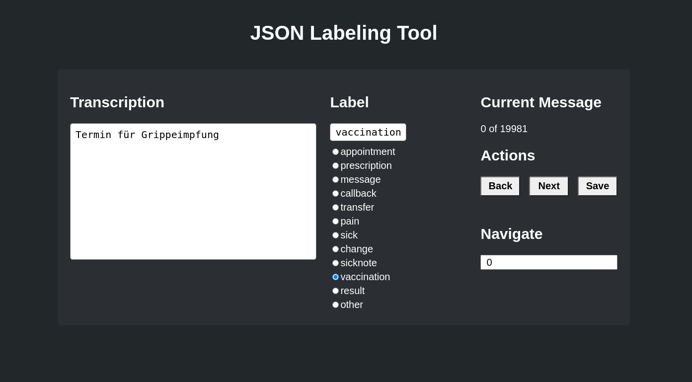

# ReactLabelingTool

_Author: Dennis Loska_

## Setup

You can use this tool to label your JSON datasets.



Simply put your JSON file in **server/data** and change the configuration file in the frontend to map your label and your data fields.

Here is an example of the expected format for the dataset:

```json
[
    {
        message: "I am a spam message",
        label: "spam"
    },
    {
        message: "I am an important message",
        label: "valid"
    }
]
```
In the configuration file of the frontend you need to add the fields **message** and **label** to the config file and also list all the labels you plan to use. Here is an example:

```js
{
  labels: ['spam', 'valid'],
  label: 'label',
  value: 'message'
}
```

That's it! now you can start labeling after a new quick commands. First install all dependencies:

```
npm install
```

Now build the project:

```
npm run build
```

And to start the application just run:

```
npm start
```

Now you can go to **http://localhost:5000** and start labeling your data!